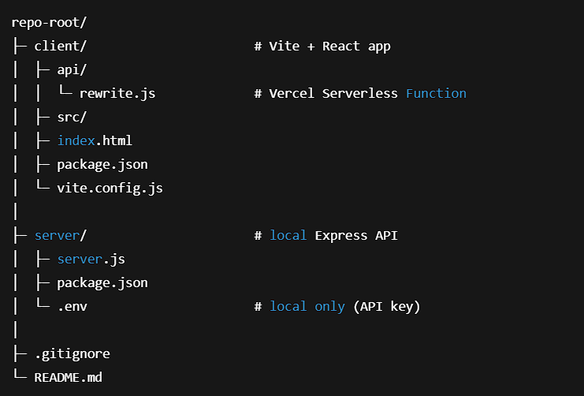
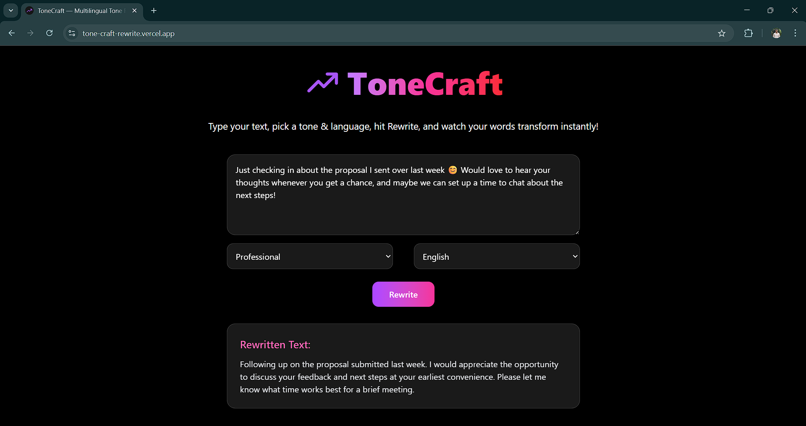

# ✍️ ToneCraft - Multilingual Tone Rewriter

ToneCraft instantly rewrites any input text into a selected tone and language—perfect for polishing emails, DMs, resumes, or captions.

The project is built with **Vite + React**, animated with **Framer Motion** and **Lordicon**, and powered by **Google Gemini** via a Vercel Serverless Function.

---

### ✨ Features

* **Tone presets (5):** Professional, Friendly, Casual, Polite, Funny
* **Languages (7):** English, Spanish, French, German, Japanese, Hindi, Mandarin Chinese
* **Fast & simple UI:** One textbox → pick tone & language → “Rewrite”
* **Smooth loading + entrance animations** (Framer Motion)
* **Serverless API on Vercel** for secure key usage (no key in the client)
* **Mobile-responsive, dark UI**
* **.env kept private** (Git-ignored, provided to Vercel as an environment variable)

---

### 🧠 How It Works

1.  User enters text and selects a tone & language.
2.  Frontend calls `POST /api/rewrite` (Vercel Serverless Function).
3.  The serverless function calls **Gemini 1.5 Flash**:
    * Instructs the model to rewrite in the chosen tone.
    * Forces output only in the selected language.
4.  The rewritten text is returned and displayed in the UI.

---

### 🗂 Project Structure

---

### 🔧 Tech Stack

* **Frontend:** Vite + React, Tailwind CSS (utility classes), Framer Motion (animations), Lordicon (animated icon)
* **Backend (prod):** Vercel Serverless Function (`/api/rewrite.js`)
* **Model:** Google Gemini 1.5 Flash (`generateContent` endpoint)
* **Hosting:** Vercel (Hobby/free)

---

## 📸 Screenshot

---

### 🤝 Acknowledgements

* Google Gemini for the rewriting engine
* Framer Motion for smooth animations
* Lordicon for the animated icons
